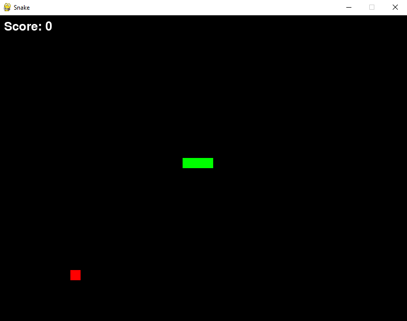
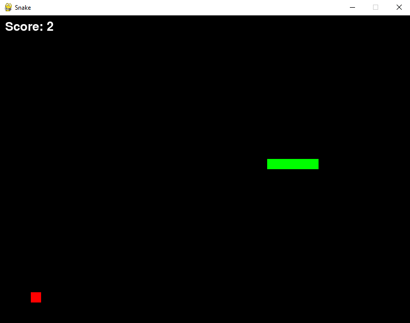

# Snake Game

Классическая аркадная игра **«Змейка»**, созданная на **Python** с использованием библиотеки **Pygame**.

## Описание

Игрок управляет змейкой, собирая еду и избегая столкновений:
* с собственным телом;
* с границами игрового окна.

С каждым съеденным кусочком еды змейка становится длиннее, а игра — сложнее.

## Демо




## Управление

* **W** — движение вверх;
* **S** — движение вниз;
* **A** — движение влево;
* **D** — движение вправо.

## Технологии

* **Python 3.x** — язык программирования;
* **Pygame** — библиотека для создания игр.

## Установка

1. Убедитесь, что у вас установлен **Python 3.x**.
2. Установите библиотеку **Pygame**, если она ещё не установлена:
   ```bash
   pip install pygame
   ```
3. Склонируйте репорзиторий
   ```bash
   git clone https://github.com/AmirCode228/Snake-Game.git
   ```
4. Перейдите в папку проекта
   ```bash
   cd Snake-Game
   ```
5. Запустите
   ```bash
   python main.py
   ```

## Правила игры
* Собирайте красные яблоки, чтобы увеличить длину змейки и набрать очки.
* Избегайте столкновений с границами экрана.
* Не допускайте, чтобы змейка столкнулась сама с собой.
* Игра заканчивается при столкновении — попробуйте побить свой рекорд!

## Лицензия
Проект распространяется под лицензией **MIT**. Подробнее — в файле [LICENSE](LICENSE)
